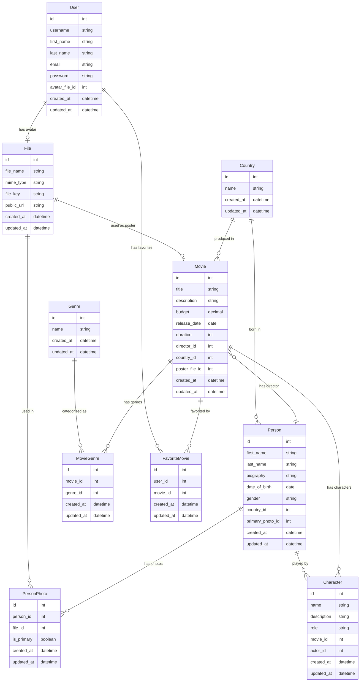

# JavaScript-Database-and-SQL

## ER Diagram for Movie Database

```mermaid
erDiagram
    User {
        id int
        username string
        first_name string
        last_name string
        email string
        password string
        avatar_file_id int
        created_at datetime
        updated_at datetime
    }

    File {
        id int
        file_name string
        mime_type string
        file_key string
        public_url string
        created_at datetime
        updated_at datetime
    }

    Country {
        id int
        name string
        created_at datetime
        updated_at datetime
    }

    Person {
        id int
        first_name string
        last_name string
        biography string
        date_of_birth date
        gender string
        country_id int
        primary_photo_id int
        created_at datetime
        updated_at datetime
    }

    PersonPhoto {
        id int
        person_id int
        file_id int
        is_primary boolean
        created_at datetime
        updated_at datetime
    }

    Genre {
        id int
        name string
        created_at datetime
        updated_at datetime
    }

    Movie {
        id int
        title string
        description string
        budget decimal
        release_date date
        duration int
        director_id int
        country_id int
        poster_file_id int
        created_at datetime
        updated_at datetime
    }

    MovieGenre {
        id int
        movie_id int
        genre_id int
        created_at datetime
        updated_at datetime
    }

    Character {
        id int
        name string
        description string
        role string
        movie_id int
        actor_id int
        created_at datetime
        updated_at datetime
    }

    FavoriteMovie {
        id int
        user_id int
        movie_id int
        created_at datetime
        updated_at datetime
    }

    User ||--o| File : "has avatar"
    User ||--o{ FavoriteMovie : "has favorites"

    File ||--o{ PersonPhoto : "used in"
    File ||--o| Movie : "used as poster"

    Country ||--o{ Person : "born in"
    Country ||--o{ Movie : "produced in"

    Person ||--o{ PersonPhoto : "has photos"
    Person ||--o{ Character : "played by"

    Genre ||--o{ MovieGenre : "categorized as"
    Movie }o--|| Person : "has director"
    Movie ||--o{ MovieGenre : "has genres"
    Movie ||--o{ Character : "has characters"
    Movie ||--o{ FavoriteMovie : "favorited by"
```
